# My 3D-Art
This is a collection of all my notable 3D works I did with Blender so far.

[First off a link to an animation of water flowing through an invisible structure](https://raw.githubusercontent.com/VectorWolf/my-art-portfolio/master/3d-art/flowing%20water.mp4) <- right-click and "save as .."

My attempt at a photorealistic render of a speaker I own..
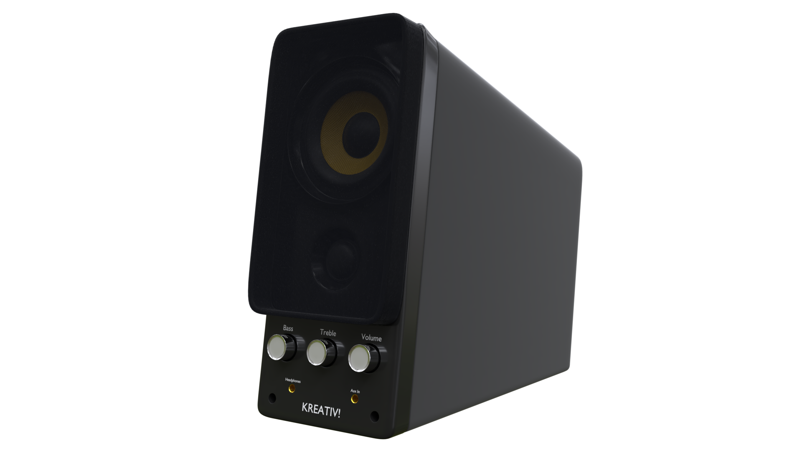

..and the same with an old Atari screen.
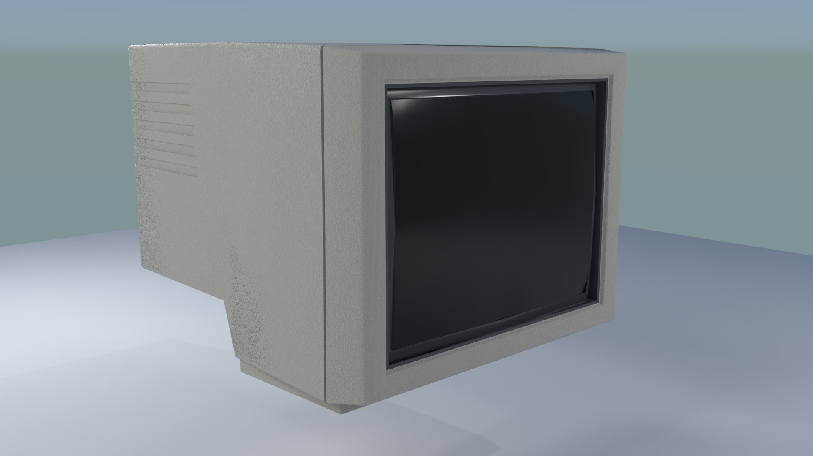

This is a dog I created with polymodeling..
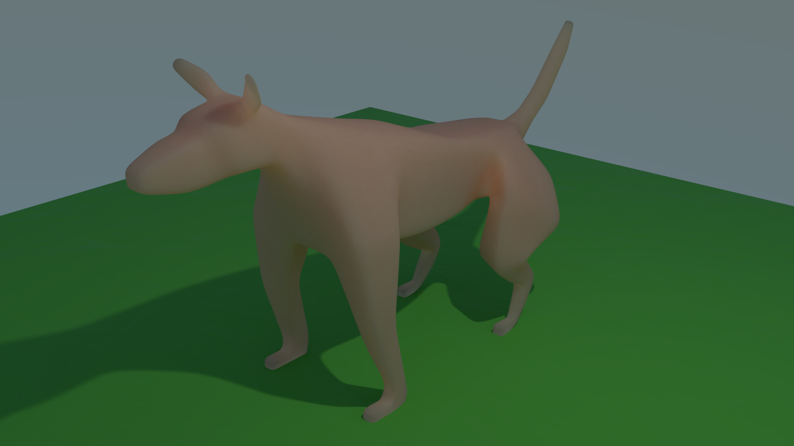

..which I further refined via sculpting into a Dobermann..
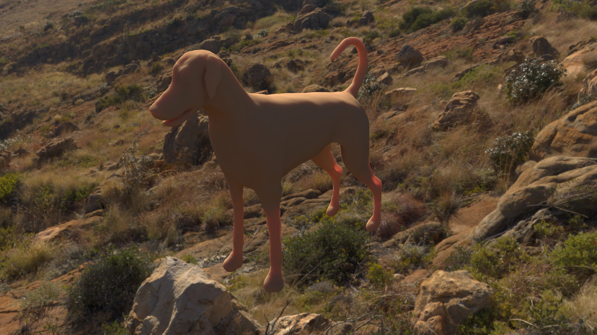

..and finally I retopologized and texturized the model..
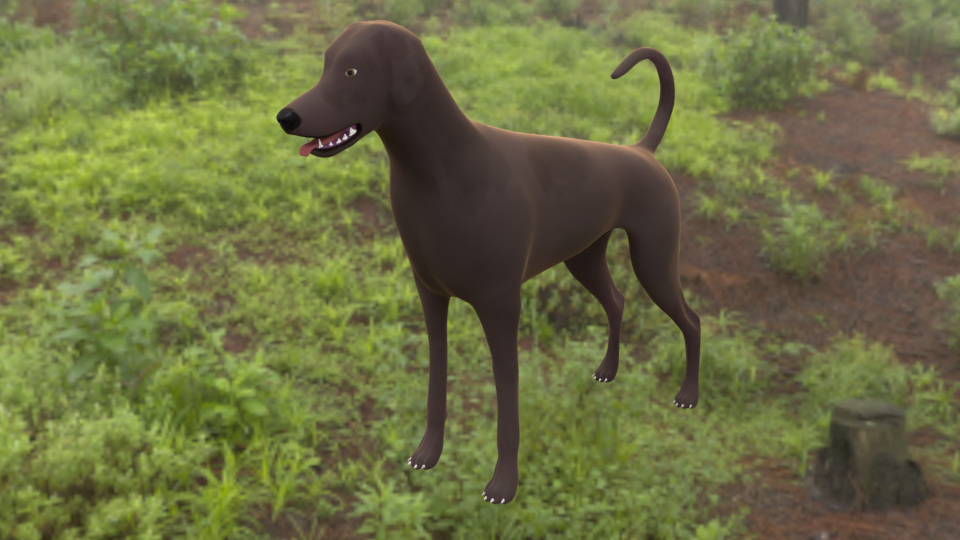

..and added a hair particle system to achieve a dog-like look.
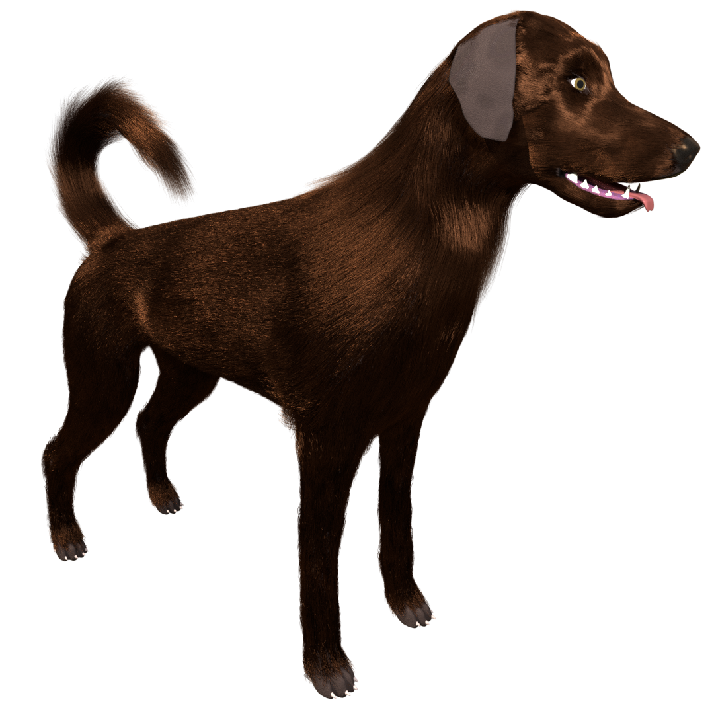

I made this sword via polymodeling with a light subsurf-modifier applied. All the textures on it are procedurally generated with node-trees I constructed.
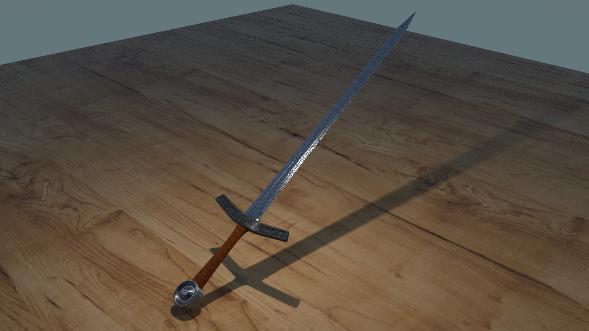

These chains actually consist of only 12 vertices. Mirror-, subsurf-, and array-modifiers were applied.
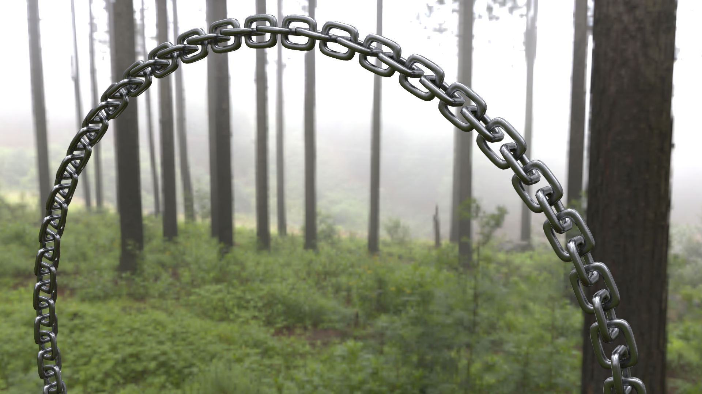

This rock is actually a simple sphere with a complex displacement node-tree applied.
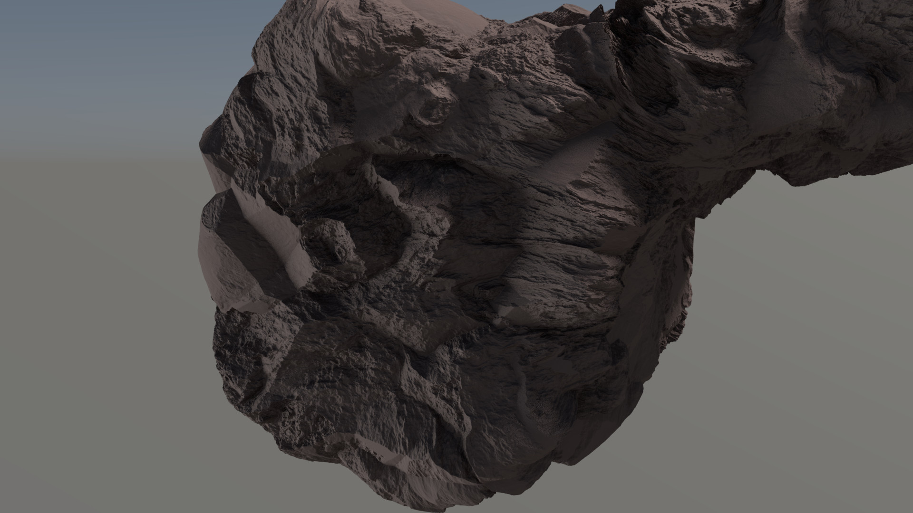

The leaves of the tree are real scans of oak leaves by me.
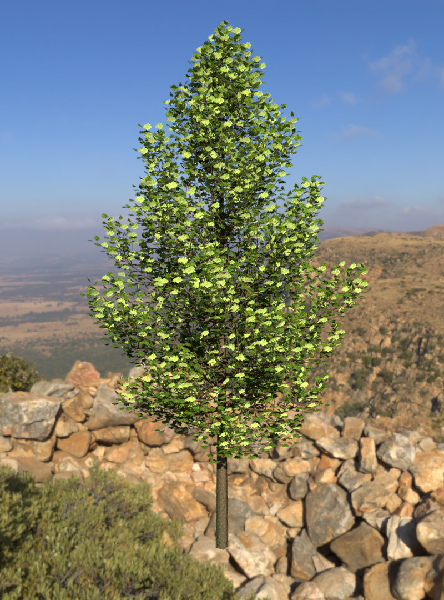

I tried out the flesh-like subsurface-scattering-material by making this tomato.
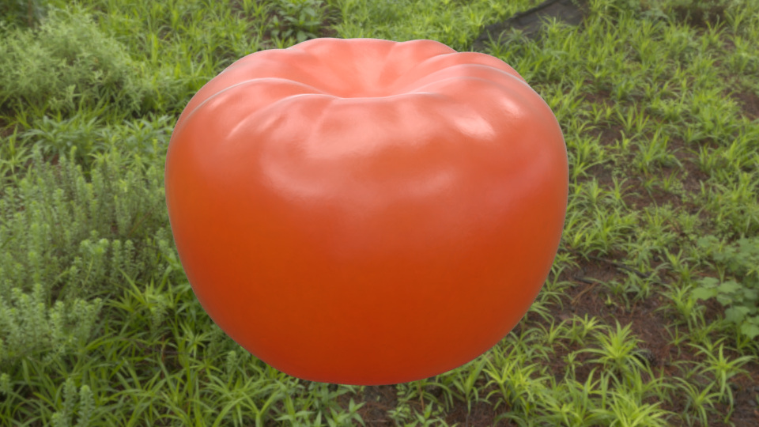

This is an early rendering of one of my practice setups.
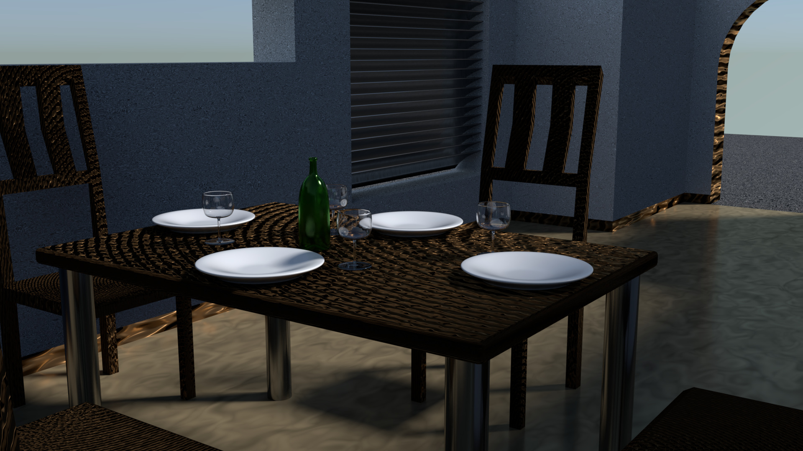

And finally a yoyo, because these things are great (and addictive)!
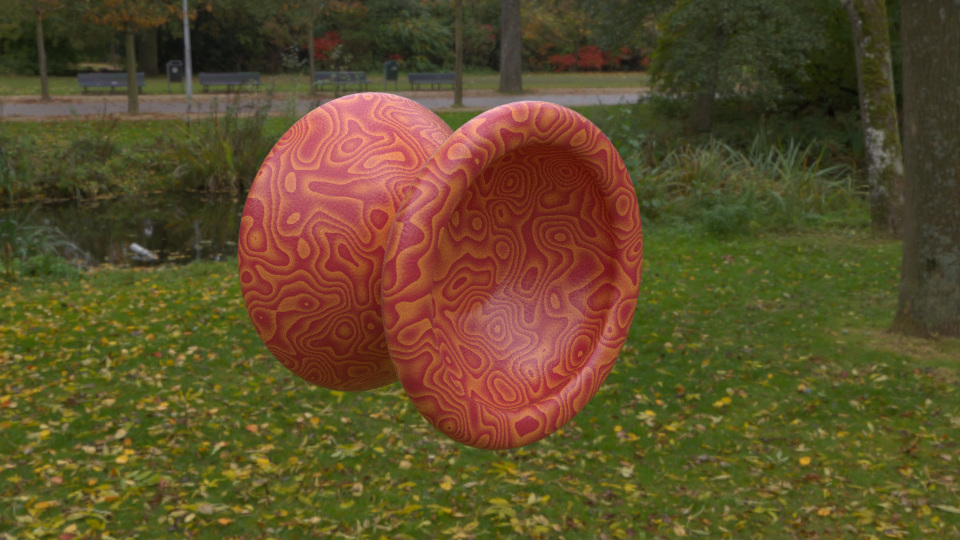
